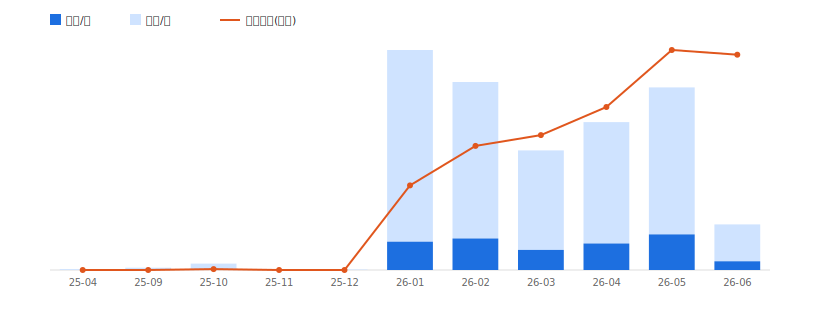

<div align="center">

# 🔬 x-account-teardown

**对任意 X(Twitter)账号做「数据级起号解剖」**

输入一个 `@handle` → 导出全部推文 → 还原它从 0 到大V 的完整起号过程

简体中文 · [English](README.en.md)

</div>

---

不是又一个「导出推文」的爬虫。它回答一个更值钱的问题:

> **这个大V,到底是怎么从 0 起号的?内容、节奏、打法是什么?我能怎么抄?**

把一个账号的全部推文按时间摊开,逆向出它的成长轨迹:**休眠期 → 起号拐点 → 内容支柱 → 发布节奏 → 回复打法 → 爆款钩子公式 → 增长曲线**,最后产出一份可直接交付、可抄作业的中文报告。

## 📈 样例(分析 @gengdaJ,法学生 14 个月做到 2 万粉)



> 一眼看穿:2025 年全年休眠,**2026-01 突然起号**(单月 62 原创 + 420 回复),橙线(原创均赞)随后强劲爬升。
> 完整报告见 [`assets/sample-gengdaJ/REPORT.md`](assets/sample-gengdaJ/REPORT.md)。

报告里你会看到:
- **起号时间线**:注册后休眠 10 个月才 all-in
- **内容支柱**:`视频 / Claude / Codex / 工具 / 模型 / 学习` —— 纯 AI 工具流
- **回复打法**:回复量是原创的 **5 倍**,靠蹲守头部账号评论区冷启动(附 Top20 蹲守对象)
- **爆款钩子公式**:Top60 高赞帖里,「第一人称亲历」×31、「保姆级教程」「免费白嫖」最密集
- **复刻清单**:5 条可直接执行的抄作业建议

## ✨ 为什么不一样

| | 普通爬虫 | x-account-teardown |
|---|---|---|
| 登录态 | 让你去开发者工具手抄 token | **自动从你登录的 Chrome 抠 cookie**(连 httpOnly 都拿,零配置) |
| 3200 上限 | 撞墙,拿不到早期帖 | **按月搜索开窗,绕过上限**,回溯到第一条 |
| 产出 | 一堆 JSON | **起号解剖报告 + 增长曲线图 + 可抄作业清单** |
| 洞察 | 无 | 自动检测起号拐点、增长斜率、钩子公式、蹲守对象 |

## 🚀 用法

这是一个 [Claude Code](https://claude.com/claude-code) Skill。装好后直接对 Claude 说:

```
分析一下 @gengdaJ 这个账号是怎么起号的
```

Claude 会自动跑完「采集 → 分析 → 出报告」,并给你一段人话解读。

### 手动跑(也可独立使用)

```bash
# 1. 装依赖(需 Python 3.10+)
python3.11 -m venv .venv && .venv/bin/pip install -r requirements.txt

# 2. 用带调试端口的 Chrome 登录 x.com(用于自动抠登录态)
/Applications/Google\ Chrome.app/Contents/MacOS/Google\ Chrome --remote-debugging-port=9222

# 3. 一条龙
.venv/bin/python scripts/acquire.py gengdaJ --out out/gengdaJ_export
.venv/bin/python scripts/analyze.py out/gengdaJ_export
.venv/bin/python scripts/report.py out/gengdaJ_export/analysis.json --out-dir out/gengdaJ_report
```

没有带调试端口的 Chrome?也可以 `--cookies 'auth_token=...; ct0=...'` 或设环境变量 `X_COOKIES`。

## 🧩 工作原理

```
acquire.py   采集:twscrape + 自动抠 cookie + 代理自适应 + 3200 绕过 + 作者过滤
   ↓ all_posts.json / profile.json
analyze.py   解剖:起号拐点检测 / 月度增长 / 内容支柱(jieba) / 节奏 / 回复打法 / 钩子 / 爆款
   ↓ analysis.json
report.py    出报告:Markdown 解剖报告 + 纯 Python 生成的增长曲线 SVG
   ↓ REPORT.md / growth.svg
```

技术细节、起号分析框架、各指标怎么解读,见 [`references/methodology.md`](references/methodology.md)。

## ⚠️ 说明

- 数据来自 X 公开接口,只反映公开可见的推文与互动。粉丝曲线 X 不公开,本工具用「均赞/均浏览随时间变化」作增长代理。
- 已删除 / 仅关注者可见的推文拿不到。
- 国内需挂代理才能连 x.com(脚本自动复用系统代理 / 探测本地 7890)。
- **⚠️ 用专门的「采集小号」登录,别用主号**:工具是拿你登录账号的身份去调 X 内部接口的,风控风险落在这个号上。高频猛刷才危险,偶尔抓几千条基本无碍。
- 仅供学习研究,请勿对同一账号高频反复采集。

## 📄 License

MIT
